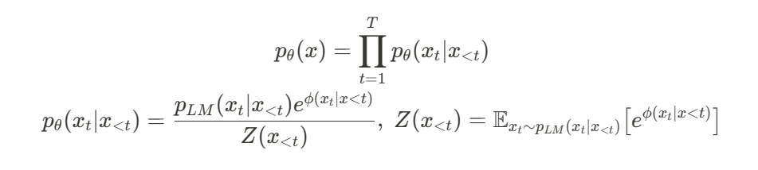
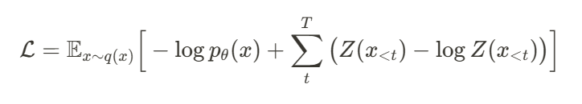
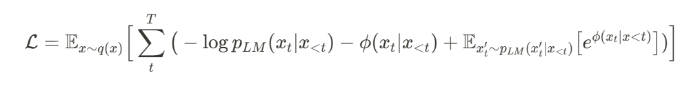
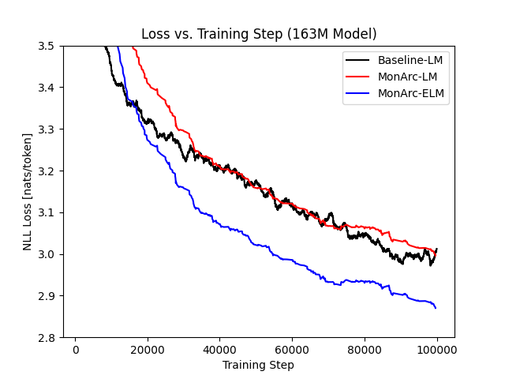
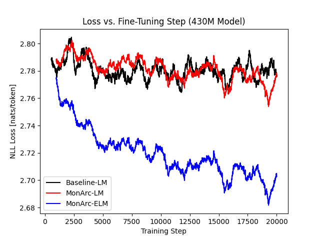

# Monarc

## Overview

MonArc is a practical method to train energy-based language models (ELMs) using a residual energy framework. In this framework, we have an autoregressive language model (LM) that samples candidates for generation, and a residual energy-based model (EBM) that resamples from those candidates to improve accuracy. The LM component is trained with the usual cross-entropy loss, while the EBM can use Noise Contrastive Estimation (NCE) or the direct optimization method described below.

Previous residual energy methods require 'negative' sequences to be sampled from the LM at training time, which is a computational bottleneck due to the non-parallelizable nature of autoregressive sampling. MonArc overcomes this limitation by having the residual EBM operate on the token level, rather than the sequence level. This means that sampling negatives only requires one parallelizable pass through the LM, greatly improving efficiency.

When using a single causal transformer decoder as both the LM and residual EBM, MonArc has shown improved performance over LM baselines when both training from scratch and adapting existing models.

### Methods
We define our model with the following parameterization, using a token-level residual EBM as described above:

We represent the model using a single transformer. The LM logits for the n-th token come from a language modeling head on top of the embeddings of the (n-1)-th token, as is standard. The energy of the n-th token is predicted by a linear head on top of the embeddings of the n-th token. This means that the model only needs to calculate the energy for a *single token at a time*, compared to the LM logits that are predicted *all at once*. We theorize that this focus makes the model more powerful. 

We train our model with the typical log-likelihood maximization, and add a regularization penalty to keep Z close to 1:

Using the specific Z-log(Z) penalty above, our loss simplifies to the tractable form:

## Experiments

### Settings
 - Data: CC-MAIN-2024-18 split of the Hugging Face FineWeb dataset
 - Tokenizer: gpt2
 - Preparation: Sequences were truncated to a maximum length of 1024 tokens. Shorter sequences are packed together to minimize padding, with attention-masking keeping them seperate.
 - Architecture: Stable LM 2 transformer architecture. MonArc models use a single transformer, with different linear heads for LM and EBM outputs.
 - Hyperparameters: Approximately the same as those used by GPT-3.

### Results

First, we train models the size of gpt2-small from scratch for 50 billion tokens, comparing a standard LM with MonArc. We see that the LM component of the MonArc model maintains similar performance to the standard LM, while the combined MonArc ELM performs better.

Second, we train a standard LM the size of gpt2-medium from scratch for 50 billion tokens. Then, we fine-tune that model using MonArc for another 10 billion tokens. For comparison, we also continue training the standard LM for 10 billion tokens. We see that the standard LM improves very slowly with continued training, while the MonArc ELM shows much more improvement. The MonArc LM component also maintains similar performance to the standard LM.

## TPU VM Setup Instructions

1. Create VM with version: `tpu-ubuntu2204-base`

2. Run command: `git clone https://github.com/aklein4/QLM.git`

3. Run command: `cd ~/QLM && . setup_vm.sh <HF_TOKEN> <WANDB_TOKEN>`
